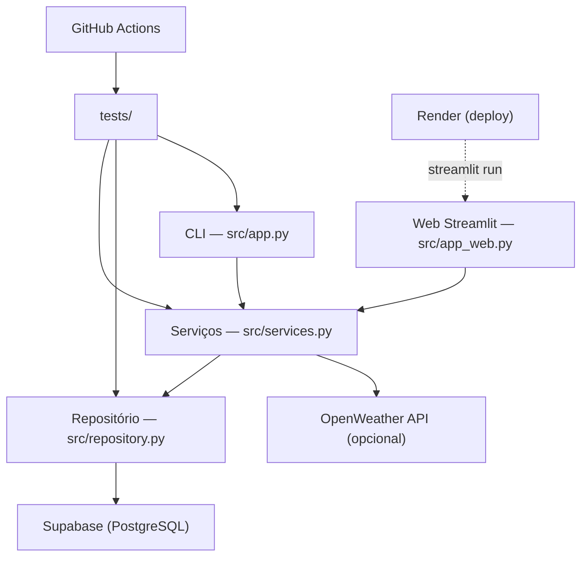

# Arquitetura — GastoSmart

## Visão geral

O GastoSmart segue uma arquitetura de 3 camadas com **duas interfaces** sobre o mesmo núcleo de regras de negócio. Cada camada tem responsabilidade única e pode ser testada de forma independente.

## Componentes

## Camadas

### 1. Interfaces de apresentação

Duas interfaces coexistem sobre o mesmo backend:

- **`src/app.py`** — CLI interativa: exibe o menu, coleta input via terminal e imprime resultados. Uso local.
- **`src/app_web.py`** — Aplicação Streamlit: 4 abas (Resumo, Listar, Adicionar, Remover) + sidebar com clima. Publicada no Render.

Nenhuma das interfaces contém regras de negócio.

### 2. Serviços (`src/services.py`)

Contém as regras de negócio:

- `adicionar_gasto`
- `listar_gastos`
- `remover_gasto`
- `resumo_gastos`
- `buscar_clima` (opcional, depende de `OPENWEATHER_API_KEY`)

Valida entradas e levanta `ValueError` com mensagens em português para violações.

### 3. Repositório (`src/repository.py`)

Única camada que importa `supabase`. Isola toda a comunicação com o banco.

Funções: `inserir`, `listar`, `remover_por_id`. Todas aceitam um `client` opcional para facilitar testes com mock.

## Persistência

- **Supabase (PostgreSQL)** hospedado em nuvem.
- Schema em `docs/supabase/schema.sql`, aplicado uma vez no painel do Supabase.
- Row Level Security habilitado com políticas abertas para a role `anon` (MVP sem autenticação por usuário).
- O JSON local (`data/gastos.json`) era legado e foi desativado após o PR-02.

## Integração externa

`services.buscar_clima` consome a API OpenWeather quando `OPENWEATHER_API_KEY` está setada. Sem chave, a CLI e a sidebar do Streamlit funcionam normalmente, apenas sem o bloco de clima.

## Configuração

`src/config.py` carrega `.env` via `python-dotenv` e expõe `get_supabase_client()`, que lê `SUPABASE_URL` e `SUPABASE_PUB_KEY` (com fallback para `SUPABASE_KEY` legado).

## Testes e CI

- `tests/test_services.py` cobre as regras de negócio com o repositório mockado.
- `tests/test_repository.py` cobre a camada de dados com o cliente Supabase mockado.
- `tests/test_app.py` cobre a delegação CLI → serviços.
- O workflow `.github/workflows/ci.yml` executa `ruff check` e `pytest` em todo push e pull request para a `main`.

## Deploy

Render → Docker → `streamlit run src/app_web.py --server.port 8501 --server.address 0.0.0.0`.

Detalhes em [`DEPLOY.md`](DEPLOY.md).

## Contexto adicional para IA

A pasta `.ai/` na raiz contém documentação estruturada para IAs copilotas, incluindo ADRs detalhados, glossários e checklist de revisão. Ver [`.ai/ai.md`](../.ai/ai.md).
