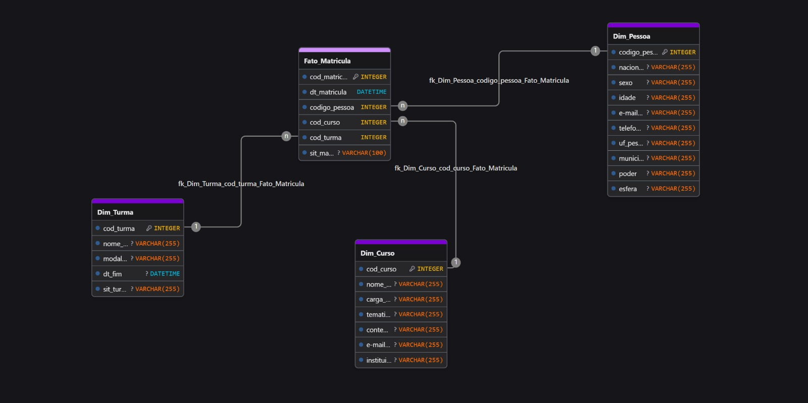

# 📊 Escola Virtual de Governo (EVG) - Business Intelligence Analytics

## 📝 Contexto do Projeto
Este projeto foi desenvolvido como parte da disciplina de Business Intelligence II. O objetivo central é transformar dados brutos e desnormalizados (One Big Table) em um modelo de dados otimizado para análise, gerando insights estratégicos sobre a eficácia dos cursos oferecidos pela Escola Virtual de Governo (EVG).

## 🏗️ Arquitetura e Modelagem de Dados
O projeto utiliza a modelagem dimensional **Star Schema**, garantindo alta performance e escalabilidade no motor VertiPaq do Power BI.
* **Fato:** `Fato_Matricula` (Eventos transacionais de inscrição).
* **Dimensões:** `Dim_Pessoa` (Perfil do aluno), `Dim_Curso` (Catálogo de produtos), `Dim_Turma` (Ofertas).
* **Engenharia:** Foram criadas *Surrogate Keys* (Chaves Substitutas) inteiras no Power Query para substituir IDs alfanuméricos pesados, otimizando o cruzamento de dados.

## 🎯 KPIs e Métricas de Negócio Desenvolvidas (DAX)
O dashboard executivo foca no engajamento e conclusão de cursos, apresentando os seguintes indicadores:
1. **Total de Matrículas:** Volume absoluto de inscrições (`COUNTROWS`).
2. **Taxa de Conclusão:** Termômetro de sucesso dos cursos, evitando erros de divisão por zero (`DIVIDE`).
3. **Horas de Capacitação Entregues:** Impacto real na sociedade, calculando horas apenas de alunos concluintes usando funções iteradoras de contexto cruzado (`SUMX` e `RELATED`).
4. **Curso com Maior Evasão:** Identificação do principal gargalo acadêmico através de manipulação de tabelas virtuais (`TOPN` e `SELECTEDVALUE`).

## 🛠️ Tecnologias Utilizadas
* **ETL & Limpeza:** Power Query (Linguagem M)
* **Modelagem e Visualização:** Power BI
* **Cálculos Analíticos:** Linguagem DAX
* **Versionamento:** Git e GitHub (Formato `.pbip`)
* **Design de Banco de Dados:** DrawDB

## 🚀 Como reproduzir este projeto
1. Clone este repositório.
2. Baixe o dataset de amostra (não incluso no repositório por questões de governança/tamanho) e coloque-o na pasta `/data`.
3. Abra o arquivo `.pbip` no Power BI Desktop e atualize a fonte de dados no Power Query.